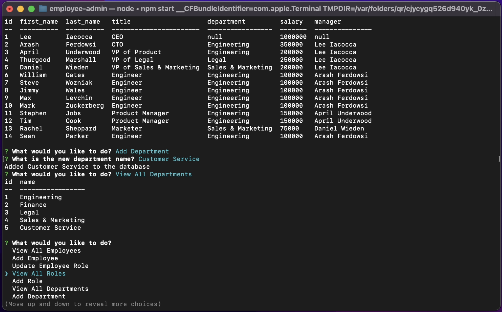

# 🗄 employee-admin

employee-admin is an employee database and administration tool that allows you to view and manage the departments, roles, and employees in your company. Built with a MySQL database and a NodeJS / inquirer command-line interface.

## Technology / Libraries Used

* MySQL
* NodeJS
    * inquirer
    * mysql2
    * console.table

## Setup

* Clone the repo
* Run `npm i` to install the required node packages
* Update the authentication details in the server.js file with your mysql username (line 11) and password (line 13).
* Create your employee_db
    * `mysql -p` and enter your password to log in to mysql
    * `source db/schema.sql` to create the employee_db and the required tables
    * (optionally) `source db/seeds.sql` to seed the database with mock employees
* Run `npm start` to run the application

View a video of how the application functions [here](https://drive.google.com/file/d/1Jc3SBeu0vrJG52QmH1Vd4eRuQfbBGsrY/view?usp=sharing)

